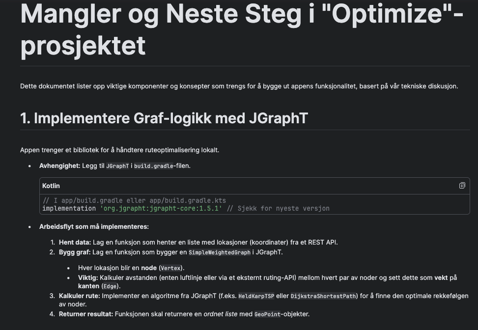
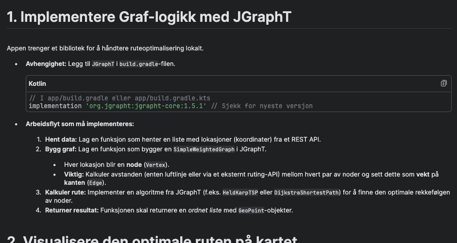
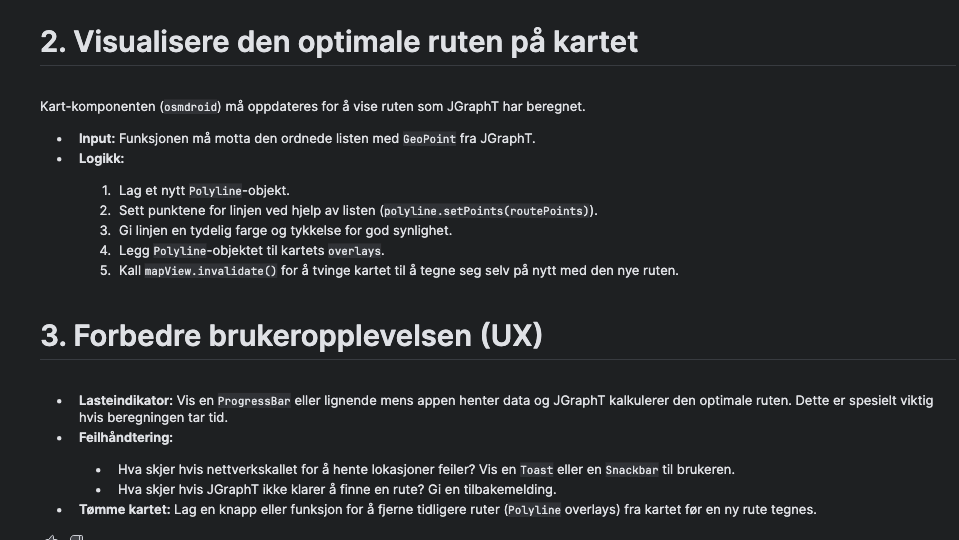

# Osm + JGraphT: Mangler og neste steg i "Optimize"

Dette dokumentet samler de viktigste punktene fra skissene og notatene for hvordan vi kobler sammen osmdroid (OSM‑kart) og JGraphT (graf/optimalisering) i appen.

—







—

## 1. Implementere graf‑logikk med JGraphT

Appen trenger et bibliotek for å håndtere ruteoptimalisering lokalt.

- Avhengighet: Legg til JGraphT i build.gradle-filen (module: app).

```kotlin
// I app/build.gradle.kts
implementation("org.jgrapht:jgrapht-core:1.5.1") // Sjekk gjerne for nyeste versjon
```

### Arbeidsflyt som må implementeres

1. Hent data
   - Lag en funksjon som henter en liste med lokasjoner (koordinater) fra et REST API.

2. Bygg graf
   - Lag en funksjon som bygger en `SimpleWeightedGraph` i JGraphT.
   - Hver lokasjon blir en node (`Vertex`).
   - Viktig: Kalkuler avstanden (enten luftlinje eller via et eksternt ruting‑API) mellom hvert par av noder og sett dette som vekt på kanten (`Edge`).

3. Kalkuler rute
   - Implementer en algoritme fra JGraphT (f.eks. `HeldKarpTSP` eller `DijkstraShortestPath`) for å finne den optimale rekkefølgen av noder.

4. Returner resultat
   - Funksjonen skal returnere en ordnet liste med `GeoPoint`‑objekter.

—

## 2. Visualisere den optimale ruten på kartet

Kart‑komponenten (`osmdroid`) må oppdateres for å vise ruten som JGraphT har beregnet.

- Input: Funksjonen må motta den ordnede listen med `GeoPoint` fra JGraphT.

### Logikk

1. Lag et nytt `Polyline`‑objekt.
2. Sett punktene for linjen ved hjelp av listen (`polyLine.setPoints(routePoints)`).
3. Gi linjen en tydelig farge og tykkelse for god synlighet.
4. Legg `Polyline`‑objektet til kartets `overlays`.
5. Kall `mapView.invalidate()` for å tvinge kartet til å tegne seg selv på nytt med den nye ruten.

—

## 3. Forbedre brukeropplevelsen (UX)

- Lasteindikator: Vis en `ProgressBar` eller lignende mens appen henter data og JGraphT kalkulerer den optimale ruten. Dette er spesielt viktig hvis beregningen tar tid.

- Feilhåndtering:
  - Hva skjer hvis nettverkskallet for å hente lokasjoner feiler? Vis en `Toast` eller en `Snackbar` til brukeren.
  - Hva skjer hvis JGraphT ikke klarer å finne en rute? Gi en tydelig tilbakemelding.

- Tømme kartet: Lag en knapp eller funksjon for å fjerne tidligere ruter (`Polyline` overlays) fra kartet før en ny rute tegnes.

—

## Notater

- `osmdroid` er allerede lagt inn i prosjektet. Polyline og overlay‑håndteringen skjer via `MapView.overlays`.
- Avstanden mellom punkter kan først beregnes som ren luftlinje (Haversine). Senere kan dette byttes ut med avstander fra et eksternt ruting‑API (OSRM/GraphHopper/Valhalla) for mer realistiske ruter.
- Hold koden modulær: Én modul/klasse for henting av data, én for graf‑bygging/optimalisering, og én for visualisering i UI‑laget.
